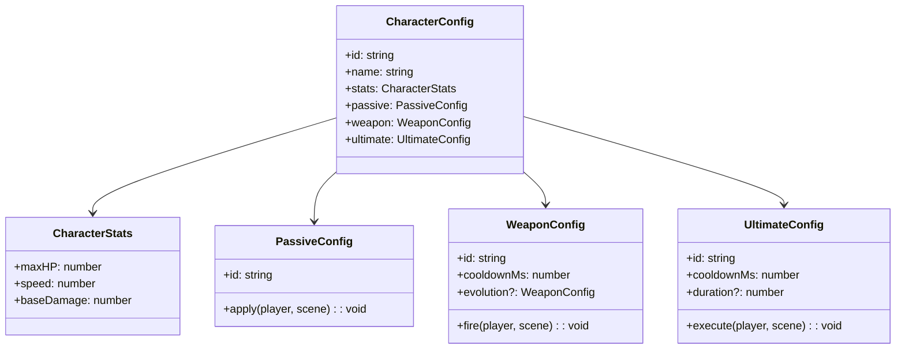

# Design: Modular Character System

## Context

The current implementation has player logic embedded directly in `MainScene.ts`. To support 6+ characters with unique mechanics, we need a data-driven, component-based architecture.

**Constraints:**
- Must maintain 60fps with 100+ entities (per `project.md`)
- TypeScript strict mode
- Phaser 3 sprites and physics
- No external state management (game state lives in Phaser scene)

## Goals / Non-Goals

**Goals:**
- Modular character definitions via configuration objects
- Weapon, Passive, and Ultimate as composable components
- Easy addition of new characters without modifying MainScene
- Type-safe character/weapon interfaces

**Non-Goals:**
- Skill trees or in-game progression (future scope)
- Networked multiplayer
- Save/load game state

## Architecture



## Decisions

### Decision 1: Configuration Objects over Class Inheritance

**Chosen:** Define characters as plain config objects with function references.

**Rationale:** 
- Simpler than deep class hierarchies
- Easier to serialize for save/load later
- TypeScript interfaces enforce structure

**Alternative:** Abstract `CharacterBase` class with subclasses per character.
- Rejected: More boilerplate, harder to mix-and-match components.

### Decision 2: Weapon Evolution via Config Swap

**Chosen:** When evolved, replace `weapon` field in character state with `weapon.evolution`.

**Rationale:**
- Clean separation between base and evolved weapon
- No complex state tracking for evolution level

### Decision 3: Ultimate Triggered via Event Bus

**Chosen:** Player presses key/button → scene emits `ultimate:trigger` → character's ultimate handler executes.

**Rationale:**
- Decouples input from execution
- Allows future UI bindings (touch button, gamepad)

## File Structure

```
src/game/
├── entities/
│   ├── characters/
│   │   ├── types.ts              # CharacterConfig, CharacterStats interfaces
│   │   ├── registry.ts           # Map of character configs
│   │   ├── pikachu.ts            # Pikachu config
│   │   ├── charizard.ts          # Charizard config
│   │   ├── blastoise.ts          # Blastoise config
│   │   ├── gengar.ts             # Gengar config
│   │   ├── lucario.ts            # Lucario config
│   │   └── snorlax.ts            # Snorlax config
│   ├── weapons/
│   │   ├── types.ts              # WeaponConfig interface
│   │   ├── thunder-shock.ts      # Thunder Shock + Volt Tackle
│   │   ├── flamethrower.ts       # Flamethrower + Blast Burn
│   │   ├── water-pulse.ts        # Water Pulse + Hydro Cannon
│   │   ├── lick.ts               # Lick + Dream Eater
│   │   ├── aura-sphere.ts        # Aura Sphere + Focus Blast
│   │   └── body-slam.ts          # Body Slam + Giga Impact
│   ├── passives/
│   │   └── index.ts              # All passive implementations
│   └── ultimates/
│       └── index.ts              # All ultimate implementations
└── scenes/
    └── MainScene.ts              # Updated to use character system
```

## Risks / Trade-offs

| Risk | Mitigation |
|------|------------|
| Complex ultimates (Blastoise pinball, Gengar reflect) may need special handling | Ultimates can store state in scene.data or custom fields |
| Performance with many projectile types | Use object pooling per weapon type (already in place) |
| Animation mismatch with new behaviors | Weapons fire generic projectiles; visuals are separate concern |

## Implementation Approach

### Phase 1: Core Types and Base Implementations
1. Create `types.ts` with all interfaces
2. Implement Pikachu (existing behavior) as first character config
3. Refactor `MainScene` to read from registry

### Phase 2: Implement All 6 Characters
4. Add remaining 5 characters with their unique mechanics
5. Each character in its own file for maintainability

### Phase 3: UI Integration
6. Add character selection before game starts

## Open Questions

1. **Evolution trigger mechanism** - Level-based? XP threshold? Manual pickup? 
   - *Suggested:* XP threshold for MVP, can add items later

2. **Ultimate cooldown UI** - How to display cooldown to player?
   - *Suggested:* Circular cooldown indicator in HUD

3. **Damage type system** - Fire/Ice types for Snorlax's Thick Fat passive?
   - *Suggested:* Add optional `damageType` field to projectiles
