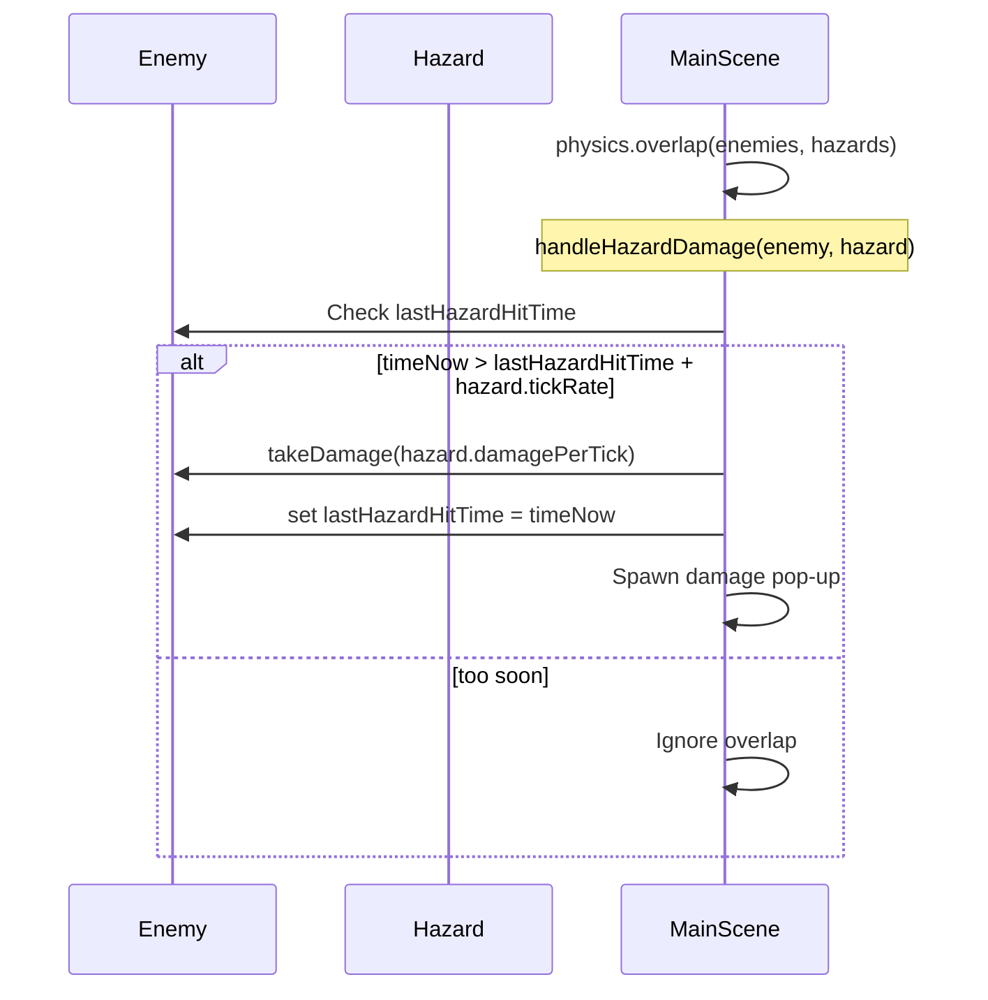

# Design: Hazard Damage System

## Problem
Environmental hazards like "Burning Ground" can deal damage very rapidly if applied every frame. We need a way to throttle damage so it follows a specific "tick rate".

## Solution: Tick-Based Damage Tracking
We will use a `lastHazardHitTime` property on enemies to track when they last took damage from a hazard.

## Implementation Details
1. **Hazard Group**: A new `Phaser.Physics.Arcade.Group` in `MainScene`.
2. **Generic Hazard Property**: Hazards should expose `damagePerTick` and `tickRate`.
3. **Enemy Property**: Enemies will initialize `lastHazardHitTime = 0`.
