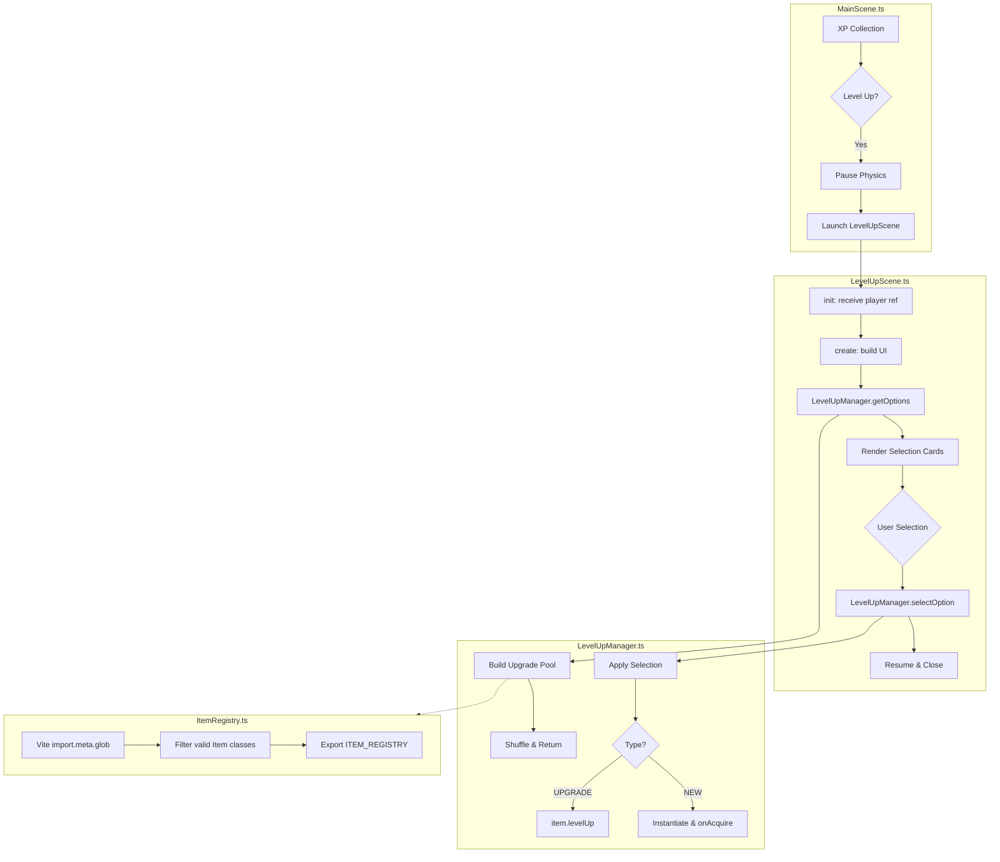

# Design: Level Up Selection System

## Architecture Overview



## Component Design

### 1. ItemRegistry (Dynamic Loader)

**Location**: `src/game/data/ItemRegistry.ts`

**Pattern**: Mirrors `weapons/index.ts` using Vite's eager glob imports.

**Glob Paths**:
- `../items/weapons/*.ts` (future weapons as items)
- `../items/passive/*.ts` (passive items)

**Filtering Logic**:
```typescript
// Pseudo-code
for (const path in modules) {
  const exports = modules[path];
  for (const key in exports) {
    const Candidate = exports[key];
    if (typeof Candidate === 'function' && Candidate.prototype) {
      const instance = new Candidate();
      // Check for Item interface compliance
      if (instance.id && instance.name && typeof instance.levelUp === 'function') {
        ITEM_REGISTRY.push(Candidate);
      }
    }
  }
}
```

### 2. LevelUpManager (Logic Layer)

**Location**: `src/game/systems/LevelUpManager.ts`

**Core Methods**:

#### `getOptions(player: Player, count: number = 4)`

**Pool Construction**:
1. **Upgrades**: Iterate `player.items`, add if `item.level < item.maxLevel`
2. **New Items**: Iterate `ITEM_REGISTRY`, add if:
   - Player doesn't have item (by `id`)
   - Player has open slots (< 6 passive items OR < 6 weapons)

**Return Structure**:
```typescript
interface LevelUpOption {
  type: 'NEW' | 'UPGRADE';
  itemClass: typeof Item;  // Constructor reference
  instance?: Item;         // Existing instance for upgrades
  displayName: string;
  displayLevel: string;    // "New!" or "Lv.2 → Lv.3"
}
```

#### `selectOption(scene: Scene, player: Player, option: LevelUpOption)`

- **UPGRADE**: Call `option.instance.levelUp(ctx)`
- **NEW**: `const item = new option.itemClass(); player.addItem(item);`

### 3. LevelUpScene (UI Layer)

**Location**: `src/game/scenes/LevelUpScene.ts`

**Scene Configuration**:
```typescript
{ key: 'LevelUpScene' }
// Launched in parallel with GameScene paused
```

**init(data)**:
- Receives `{ player: Player, onComplete: () => void }`

**create()**:
1. **Pause Parent**: `this.scene.pause('MainScene')`
2. **Background**: Fullscreen rectangle with `alpha: 0.8`
3. **Cards**: Generate 3-4 interactive containers
4. **Buttons**: Reroll (refresh options), Skip (resume without selection)

**Card Structure**:
- Item icon (texture or generated graphic)
- Item name
- Level indicator ("New!" or "Lv.X → Lv.Y")
- Pointerdown handler

### 4. Integration Changes

**MainScene.ts Modifications**:

Replace `UIManager.showLevelUpMenu()` call with:
```typescript
this.scene.launch('LevelUpScene', {
  player: this.player,
  onComplete: () => {
    this.scene.resume();
    this.isLevelUpPending = false;
    this.uiManager.setLevelUpPending(false);
  }
});
```

## Slot Limit Design

| Category | Max Slots |
|----------|-----------|
| Weapons  | 6         |
| Passives | 6         |

**Tracking**: Add to `Player.ts`:
- `get weaponCount(): number`
- `get passiveCount(): number`

Or detect by iterating `player.items` and checking item type.

## Edge Cases

1. **Empty Pool**: If `pool.length < count`, return entire pool (may be 0-2 options)
2. **All Maxed**: If everything is maxed, show "All items maxed!" message
3. **Scene Cleanup**: Properly destroy scene on close to prevent memory leaks
